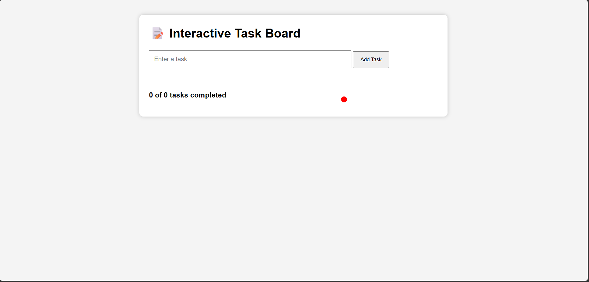
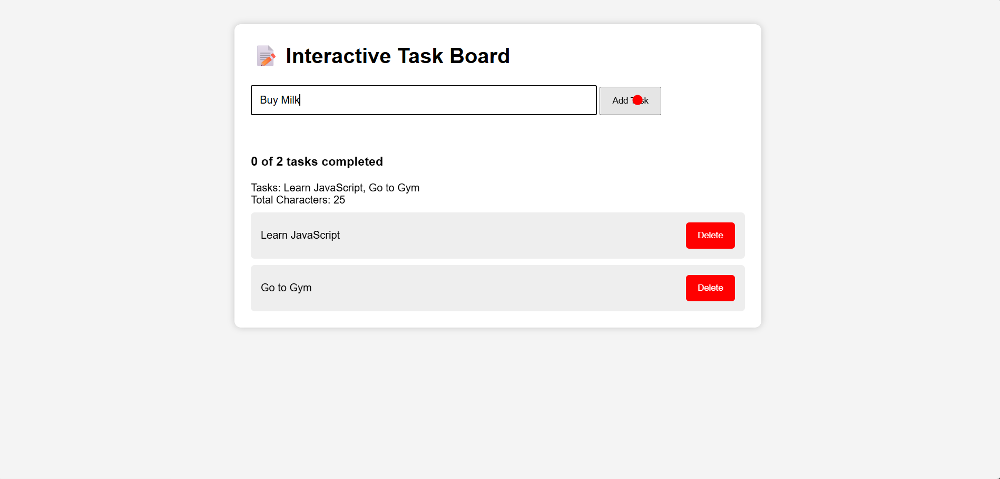
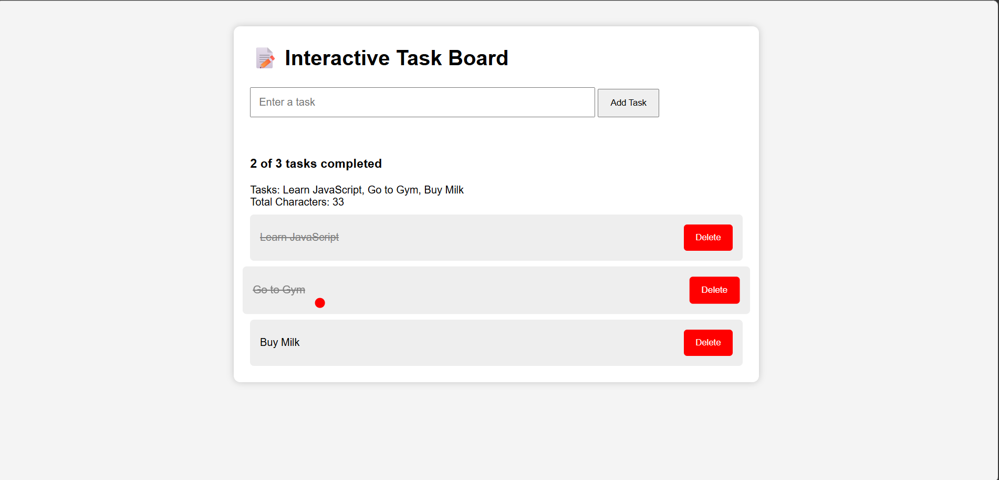

# 📝 Interactive Task Board

An interactive **Task Board** built using **HTML, CSS, and Vanilla JavaScript**. This project was created while learning JavaScript fundamentals and combines DOM manipulation, event handling, array methods, animations, and dynamic UI updates into a single mini-project.

---

## 📸 Project Preview

### 🏠 Homepage



---

### ➕ Task Added



---

### ✅ Completed Task



---

## 🚀 Features

- ➕ Add new tasks dynamically
- ✅ Mark tasks as completed
- 🗑️ Delete tasks
- ✨ Double-click animation before deleting a task
- 📊 Live task statistics (e.g., **2 of 5 tasks completed**)
- ⏳ Temporary **"Task Added!"** notification using `setTimeout()`
- 🎨 Smooth hover animations using `transform` and `transition`
- 🖱️ Custom cursor effect
- 🔄 Dynamic DOM rendering

---

## 🛠️ Technologies Used

- HTML5
- CSS3
- JavaScript (ES6)

---

## 📚 JavaScript Concepts Practiced

### Variables
- `let`
- `const`

### Functions
- Function Declaration
- Callback Functions

### Arrays & Objects
- Arrays of Objects
- `push()`
- `splice()`

### Array Methods
- `forEach()`
- `map()`
- `filter()`
- `reduce()`

### DOM Manipulation
- `getElementById()`
- `querySelector()`
- `createElement()`
- `appendChild()`
- `remove()`
- `classList.add()`
- `classList.toggle()`

### Event Listeners
- `click`
- `dblclick`
- `mousemove`

### CSS Effects
- `transform`
- `transition`
- Hover Effects

### Timers
- `setTimeout()`

---

## 📂 Project Structure

```text
Final Project/
│
├── index.html
├── style.css
├── script.js
├── README.md
│
└── screenshots
    ├── Homepage.png
    ├── TaskAdded.png
    └── CompletedTask.png
```

---

## ⚙️ How to Run

1. Clone the repository:

```bash
git clone https://github.com/your-username/interactive-task-board.git
```

2. Open the project folder.

3. Open **index.html** in your browser.

---

## 🎯 Learning Outcomes

This project helped me practice and strengthen my understanding of:

- JavaScript Fundamentals
- Functions
- Arrays & Objects
- Array Methods (`map`, `filter`, `reduce`, `forEach`)
- DOM Manipulation
- Event Handling
- CSS Animations
- Dynamic Rendering
- Problem Solving

---

## 🔮 Future Improvements

- 💾 Save tasks using Local Storage
- ✏️ Edit existing tasks
- 🌙 Dark Mode
- 📅 Due Dates
- 🏷️ Task Categories
- 🔍 Search & Filter Tasks
- 📱 Responsive Design
- 🎯 Drag & Drop Task Sorting

---

## 👨‍💻 Author

**Ayush Kushwaha**

- GitHub: https://github.com/your-username

---

⭐ If you found this project helpful, consider giving it a **star** on GitHub!
